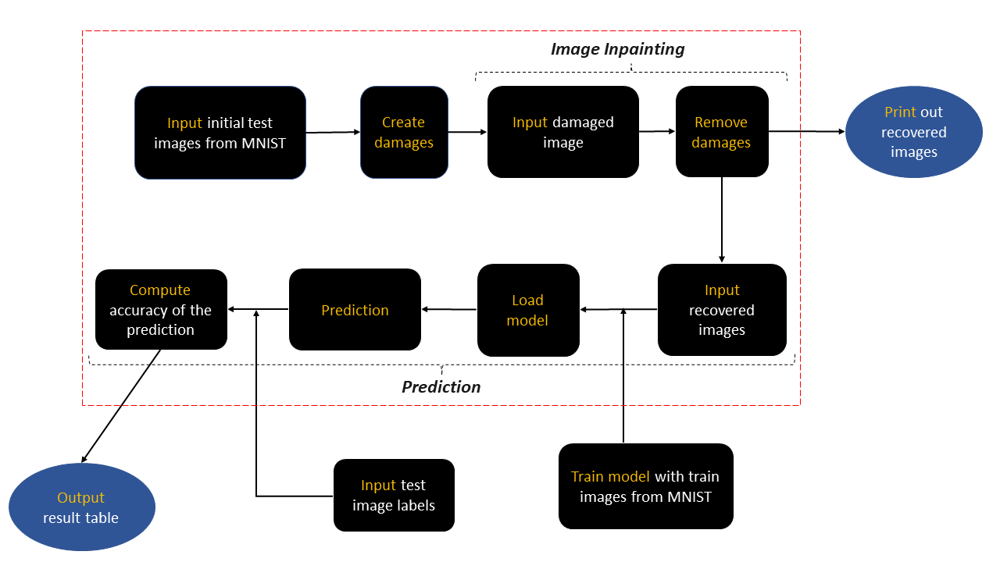

# Enhanced Image prediction through Cahn-Hilliard image inpainiting
Pattern recognition, as a branch of the promising machine learning technique, has been applied in many fields. But insufficient information in the input may lead to unexpected results. In this work, I successfully enhanced the predicability of damaged binary images by applying image inpainting prior to a neural network model. This project combined the knowledge from classical chemical engineering field as well as the promising machine learning technique.

To prove the enhancement, we used the numerical digits from mnist handwritten database and created damage in advance. Subsequently, the accuracy of recognition before and after the restoration can be compared. In practice, we are unlikely to destroy the information in hand, the chief aim of this work is to give an idea that it is possible to extract useful information from a damaged image, if a neural network somehow successfully integrated with the inpainting process.   

## Cahn-Hilliard Equation Solver
Cahn-Hilliard(CH) equation is originally used to model two-phase fluid dynamics, which is applied to complete image inpainting task in this project. A numerical scheme based on the finite volume method is constructed to solve the CH equation. In addition, a two-step method is employed to deal with the large damaged domains in images.

## Neural network model

